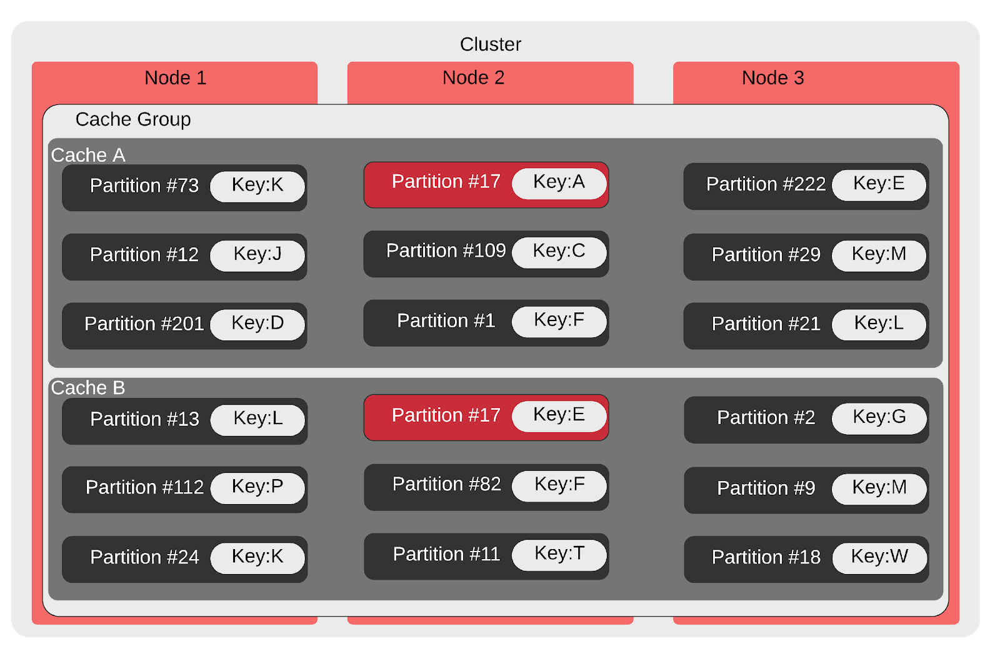

# Distributed Cache

Distributed and in-memory key/value database. It can be used both as an embedded Go library and as a language-independent service. Built with Go.

## Features

* Designed to share some transient, approximate, fast-changing data between servers
* In memory with replication.
* Data rebalanced when node Join/Leave.
* Highly available
* Horizontally scalable.
* Distributes load fairly among cluster members with a [rendezvous hashing](https://en.wikipedia.org/wiki/Rendezvous_hashing) and data partition.
* HTTP/2 and grpc APIs.
* Protobuf messaging.
* Json and protobuf supported by default as serialization format
* ID based data partition. (Distributed Set/List/Queue)

## Data partitioning and routing

All data are partitioned to a set of buckets and routing buckets to hosts. Partition data to buckets because it is easy for data re-balance. Partitions routing to hosts with `rendezvous hashing`.

Client don't need cache the routing information, it just only need cache the host list information, the the algorithm would keep concurrency of the routing of data.

```go
func Get(key string, hosts []string, partitionCount int) (host string) {
    partitionID := hash(key) % partitionCount
    maxHash := uint64(0)
    for _, h := range hosts {
        hashCode := RendezvousHash(partitionID, hash(h))
        if hashCode > maxHash {
            maxHash = hashCode
            host = h
        }
    }

    return host
}

func hash(v string) uint32 {
    // CRC32.
}

func RendezvousHash(key0, key1 uint32) uint64 {
    key := uint64(key0) | (uint64(key1) << 32)
    key = (^key) + (key << 21) // key = (key << 21) - key - 1;
    key ^= (key >> 24)
    key += (key << 3) + (key << 8) // key * 265
    key ^= (key >> 14)
    key += (key << 2) + (key << 4) // key * 21
    key ^= (key >> 28)
    key += (key << 31)

    return key
}

```

## Cluster re-balance



